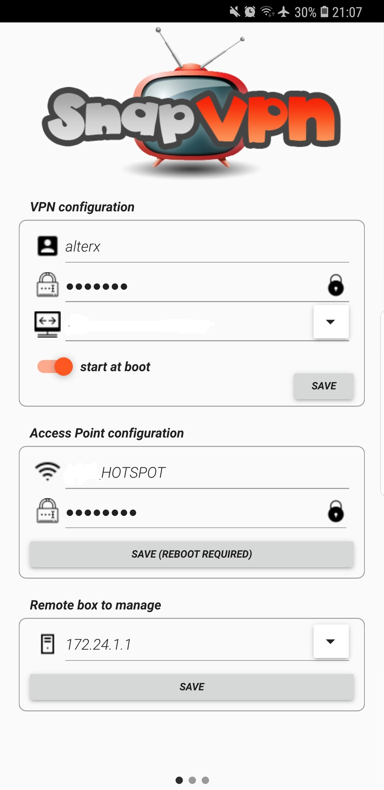
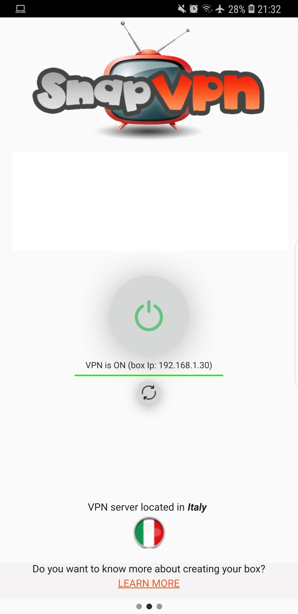
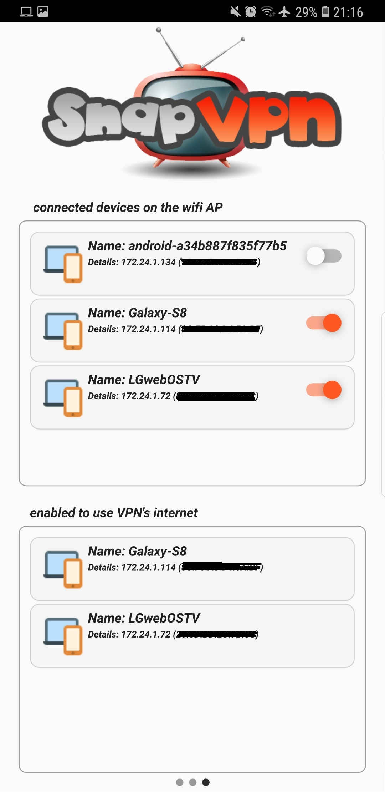

Create a VPN connection from within a device such as smartphone or desktop is something that already exist. But what about
having it working on one or more smartTVs just using the wifi connection? 
Right now smartTV doesn't allow to create VPN connection and so watching your preferred channel not available when you are or live 
abroad becomes a nightmare...right you can use your pc to create the VPN and mirroring it with the TV, consuming power and create 
latency to not count if you want to change the movie or the channel you are watching... 
I have been living abroad for several years and I wanted to whatch my soccer team playing in the second league from abroad... 
a nightmare with <b>DAZN</b> that allows you just to play local content (even if the account is for another country!). 
I then came with an idea (that is already working)  based on having a box (so far a bananapi) able to act as WIFI Access Point that extend an
internet connection (you just need to plug-in the RJ45 cable and you are already online) and at same time it is able to establish
a VPN connection (right now only pptp is supported) and use it as alternative gateway. It depends on what IP you want to redirect to the VPN
and the trick is done!  
<b>I like to call it as abstraction of a VPN using a WIFI AP</b>. 
You didn't yet understand it? 
Well let's do an example: 
Starting the box, it creates a WIFI AP where any of your devices can connect to (using a password). Any of these devices can automatically
surf internet either using your standard internet connection or going through a VPN (of course you need a VPN server located somewhere). 
As result playing <b>DAZN</b> app (<b>amazone prime</b> or <b>netflix</b>) straight from a smartTV (or from other devices) and just watching content available in another country
without hassle of consuming extra power or using mirroring or bother with changing channel from a pc becomes really trivial!  

Benefit: 
1. Cheap solution (a cost for such device is roughly 60~80 euro) 
2. Extremely low power consumption 
3. Extend your WIFI in a place not reached by your router 
4. Having access to the local network of the VPN 
5. Having several devices able to go through one VPN gateway WITHOUT using a vpn client 
6. Dynamic routing of devices towards VPN or internet gateways 
7. No hassle to configure and get it up and running
8. when you are done, you can always use it as small pc
 
The image will be released for free here and you can also download from the major stores an app (not free of charge) that is allowing you to perform all of these
operation easily:  
1. Start/Stop a VPN 
2. Automaticaly start a VPN at device reboot time 
3. Allow/Deny a device to go thru a VPN gateway 
4. Create/delete/change a VPN connection 
 

  
What you need: 
1. An SD with at least 4GB 
2. A BananaPI M1 
3. A WIFI dongle (<b>Edimax EW-7811UTC</b>) 
4. A RJ45 cable 
5. A power supply 
6. A SD writer device 
 
Have fun!

